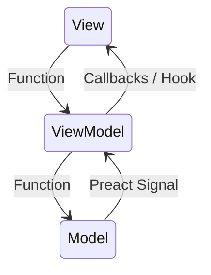

Hello Coders! 👾

Back in the days of Silverlight and later WPF MVVM was my go-to pattern to bind my _models_ to the _views_. It is a great way to separate concerns in a project. I realized it works pretty well for games too! Back then, I used C# with the INotifyPropertyChanged interface. In this post, I will be using **TypeScript** and a reactive state system. The principles are the same though. It's all about separating concerns and keeping the code maintainable.

## Building Games with MVVM

When developers hear about MVVM, they often think about business applications, desktop software, or maybe mobile apps. However, MVVM can be just as valuable in game development, especially for projects that are expected to grow beyond a simple prototype.

MVVM helps separate game rules, game flow, and presentation concerns into distinct layers. This makes a game easier to maintain, test, and extend without creating tight coupling between gameplay systems and user interface code.

## What Is MVVM?

MVVM stands for: `Model`-`View`-`ViewModel`. The name is slightly misleading because it implies that the ViewModel is a model of the view. In reality, the ViewModel is a mediator between the View and the Model.

Each layer has a clear responsibility.



The goal, in the case of games, is to keep rendering, logic, and data or services separate. The view and the model should never directly talk to each other. Instead, the ViewModel acts as a mediator between the two. The ViewModel is the only place where logic is allowed.


## The Model

The Model represents game data and domain state.

In a game, this could be: Puzzle definitions; Tile information; Current puzzle state; Move counts; Session progress.

The Model does not have to know anything about how the UI is rendered, which buttons exist, or what game engine is used. It should be completely independent of the presentation layer.

A good Model focuses entirely on representing the state and behavior of the game domain.

### Does The Model Contain Logic?

If you look at it very strictly, yes, the model should not contain logic. However, in reality, that statement is often a bit too simplistic.

But a useful guideline I like to use is:

- Models should not contain presentation logic.
- Models should not contain UI logic.
- Models may contain _VERY_ simple domain logic.

For example:

```ts
export class Player {
	public health = 100;
	public score = 0;

	public addScore(points: number): void {
		this.score += points;
	}

	public takeDamage(amount: number): void {
		this.health = Math.max(0, this.health - amount);
	}
}
```

While both `addScore()` and `takeDamage()` technically contain logic in this example, but they are responsible for managing the player's state. That makes them domain logic and a perfectly reasonable responsibility for the Model.

The confusion often comes from mixing different kinds of logic together.

#### Domain Logic

Domain logic represents the rules and behavior of the game world.

```ts
player.takeDamage(10);
player.addScore(100);
inventory.addItem(sword);
puzzle.isSolved();
```

This logic belongs in Models or dedicated domain services.

#### Presentation Logic

Presentation logic exists purely to help the UI display information.

```ts
public get scoreText(): string {
	return `Score: ${this.player.score}`;
}
```

This belongs in the ViewModel.

The game world does not need a formatted score string. Only the UI does.

#### UI Logic

UI logic controls visual behavior and screen interactions.

```ts
public get canShowContinueButton(): boolean {
	return this.saveGameExists;
}
```

This is also ViewModel responsibility.

### A Useful Rule Of Thumb

Ask yourself: "Would this code still exist if the user interface disappeared?". If the answer is yes, then it's probably domain logic.

```ts
player.takeDamage(10);
character.levelUp();
puzzle.validate();
```

If the answer is no, then it's probably presentation logic.

```ts
showHealthWarning();
scoreText();
isStartButtonEnabled();
```

The most maintainable game architectures keep these two categories separate.

## The View

The View is what the player sees and interacts with. For example, Main menu screens, HUD elements, Puzzle complete dialogs or Buttons and labels.

The View should be responsible for rendering information, binding to user interactions and observing state changes. However, the View should not validate puzzle rules or manage game progression. If you have a function that is called when a player clicks a button, and it contains more than passing it on the ViewModel (it contains some game rules for example), the View is becoming too smart.

## The ViewModel

The ViewModel sits between the View and the rest of the application. Its job is to translate application behavior into a format that is easy for the View to consume. In a typical TypeScript game that's using React, ViewModels might be implemented as hooks, controllers, or presentation models such as:

- `useMainMenuViewModel()`
- `useGameHudViewModel()`
- `useSettingsViewModel()`

The ViewModel is responsible for calling services, exposing commands, providing derived UI state, and adapting domain information for presentation. Ideally, you would even want to move the game logic even deeper into services, so the ViewModel is mainly responsible of orchestrating the flow of information between the View and the Model and making sure the data is handled correctly.

## MVVM in a Game Flow

Consider a player starting a new puzzle.

```text
Player clicks Start
	↓
MainMenuPanel (View)
	↓
useMainMenuViewModel (ViewModel)
	↓
GameFlowService (Service)
	↓
PuzzleService (Service)
	↓
Puzzle Session Created (Model)
	↓
Signals Update (ViewModel)
	↓
UI Refreshes (View)
```

Notice that the UI never directly manipulates puzzle data. Instead, it asks the ViewModel to perform an action, and the ViewModel delegates that work to the appropriate service.

## Why Use MVVM in Games?

### 1. Better Separation of Concerns

One of the biggest problems in game projects (as it is basically with all software projects) is that gameplay code might slowly leak into UI code or data repositories. Just a quick bugfix here, a new feature there, and slowly the codebase becomes a mess. And when you realize this, it's often too late to easily fix it.

Menus start containing game rules, buttons begin modifying state directly, and UI components become responsible for progression systems. Until you want to add a new feature or there's a bug, and you need to spend hours trying to fix it with risking breaking something else. This is a common problem in many game projects, especially when multiple developers are working on the same codebase.

MVVM prevents this by giving each layer a clearly defined responsibility.

### 2. Easier Testing

When game logic lives outside UI components, it becomes much easier to test. For example, to test some input validation, it's easier to test when you don't have to actually interact with the UI. Or if you want to test some session management, it's easier to test without actually loading a scene in a game engine. The great thing is that you can test ViewModels and Services in isolation. This significantly reduces the cost of maintaining larger projects.

Even if you are not writing automated tests at the start of the project, having a clear separation of concerns keeps the option open to add them later.

### 3. Engine Independence

A strong architecture keeps domain logic independent from engine-specific code. Game Components in Wonderland Engine or other engines act as adapters. In a well-structured MVVM setup, Services coordinate gameplay. Domain models own state.

As a result, the core game logic (or parts of it) could potentially be reused in another engine and tested separately without having to rely on engine-specific features.

### 4. Cleaner Scaling

Many prototypes start simple. Then more features arrive. You want to add a save system, tutorial, analytics, different ways to play, challenges, achievements, the list goes on and on. The more features you add, the more complex the codebase becomes. And the greater the risk of getting into unmaintainable spaghetti. Good patterns like MVVM help control that complexity by keeping responsibilities organized.

### 5. Improved Team Collaboration

When responsibilities are clearly defined UI developers can work on Views, Gameplay developers can work on Services and Models, and Technical designers can focus on game rules. The architecture naturally reduces merge conflicts between systems.

## MVVM and Reactive State

MVVM becomes especially powerful when combined with reactive state management. Many modern game architectures use reactive state systems. Instead of manually refreshing UI, state changes automatically propagate through the system. In my current games, I use [Preact Signals](https://preactjs.com/guide/v10/signals/) for this purpose. I don't rely on the entire Preact library. They provide a package `@preact/signals-core` that only contains the Signals.

The flow of a game might look like this:

```text
Tile State Changes
	↓
Signal Updates
	↓
ViewModel Observes
	↓
View Re-renders
```

This creates predictable and maintainable data flows.

## Common Mistakes

There are a couple of common mistakes developers might make when implementing MVVM. There's no tools (maybe AI nowadays) that can prevent code ending up in the wrong location. Some governance and code reviews are often necessary to keep the architecture clean. Often the mistakes are made because intellisense makes it easy to refecence and call a service or model directly. It gives a suggestion, it's accepted, and the first tiny violation is made. Then the next one, and the next one. Until the architecture is broken and the codebase is a mess.

### Putting Business Logic in the View

```
Bad:
    - Button decides whether a puzzle is complete.
    - UI directly modifies game state.

Better:
    - View calls a ViewModel command.
    - Service performs validation.
```
### Putting UI Logic in Services

```
Bad:
    - Service knows about panels and buttons.

Better:
    - Service exposes state.
    - ViewModel decides how the UI should present it.
```

### Creating Massive ViewModels

There's a risk that a ViewModel can become too large. A ViewModel should adapt state for a specific screen. If it starts coordinating large portions of the game, responsibilities should move into dedicated services. When also using depenceny injection through the constructor, it becomes easy to see when a ViewModel is doing too much, as there will be too many dependencies injected into the constructor. If that happens, it's a good indication that the ViewModel is doing too much and should be split into smaller, more focused components. I usually try to keep the dependencies to a maximum of 5. If it goes beyond that, it's time to refactor.

## Final Thoughts

MVVM is not about adding layers for the sake of architecture. It is about assigning ownership correctly: Models own state; ViewModels own presentation logic; Views own rendering.

MVVM helps keep gameplay rules independent from UI concerns while supporting scalable, event-driven architectures. Combined with services, reactive state, and domain-focused models, it creates a foundation that can grow from a simple prototype into a much larger game without collapsing under its own complexity.

## TypeScript Examples

### Model

The Model owns game state.

```ts
interface IPlayerModel {
    health: ReadonlySignal<number>;
    score: ReadonlySignal<number>;
}

export class PlayerModel implements IPlayerModel {
	public health = signal(100);
	public score = signal(0);

	public addScore(points: number): void {
		this.score.value += points;
	}
}
```

The Model knows nothing about buttons, menus, or rendering.

### Service

Services contain application and gameplay logic.

```ts
export interface IGameService {
    defeatEnemy(): void;
}

export class GameService {
	public constructor(private readonly player: IPlayerModel) {}

	public defeatEnemy(): void {
		this.player.addScore(100);
	}
}
```

### ViewModel

The ViewModel adapts gameplay state for the UI.

```ts
export class HudViewModel {
	public constructor(
		private readonly player: IPlayerModel,
		private readonly gameService: IGameService
	) {}

	public get scoreText(): string {
		return `Score: ${this.player.score}`;
	}

	public onDebugRewardClicked(): void {
		this.gameService.defeatEnemy();
	}
}
```

### View

The View binds UI elements to the ViewModel.

```ts
export function Hud(viewModel: HudViewModel) {
	return {
		scoreLabel: viewModel.scoreText,
		rewardButton: () => viewModel.onDebugRewardClicked()
	};
}
```

Notice the flow:

```text
Player Input
	  ↓
View
	  ↓
ViewModel
	  ↓
Service
	  ↓
Model
	  ↓
UI Refresh
```

Each layer has a single responsibility, making the system easier to reason about, test, and extend.

## Wrap Up

If your game is expected to grow (and it probably will), MVVM is one of the most practical architectural patterns available for keeping that growth manageable. There are a couple of patterns and principles that go very well with MVVM in games, such as the Service Locator pattern, Event-Driven Architecture, and even the SOLID principles. But those are topics for another post. Stay tuned for more!

Happy Coding! 🚀




